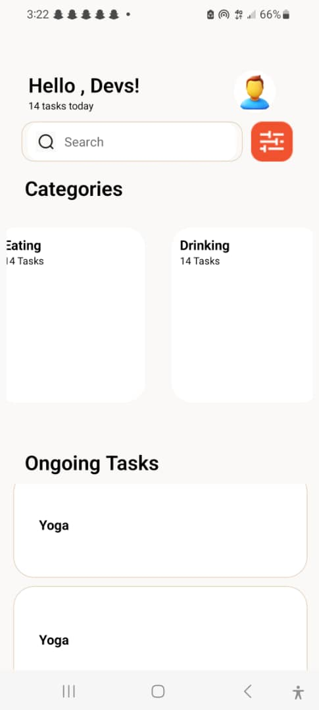

# rn-assignment3-11178252
## DCIT 202 Assignment 3

This is a mobile application built with React Native based on the UI given The app consists of two main components: Categories and SearchBar.

### Components

#### Categories

The Categories component displays a horizontal list of categories, each represented by a card containing the category title, the number of tasks in that category, and an image. This component is useful for providing a visual overview of the different task categories available in the app.

```javascript
<Categories data={categoryData} />
```


#### SearchBar

The SearchBar component provides a search input field that allows users to search for specific tasks or categories. When the user starts typing in the search bar, it expands to show a clear button, which can be used to reset the search query.

```javascript
<SearchBar
  clicked={searchClicked}
  searchPhrase={searchPhrase}
  setSearchPhrase={setSearchPhrase}
  setCLicked={setSearchClicked}
/>
```

Header
The Header component displays the app's logo and title at the top of the screen.

```javascript
<Header />
```


#### Tasks

The Tasks component displays a list of tasks, each represented by a card containing the task title, description, and due date. This component is useful for displaying the user's tasks in a organized and visually appealing manner.

```javascript
<Tasks data={taskData} />
```


React Native Components Used
The following React Native components are used in this project:

`View`: A container for other components.\
`Image`: Displays an image.\
`Text`: Displays text.\
`StyleSheet`: Defines styles for components.\
`FlatList`: Renders a scrolling list of data.\
`TextInput`: Allows user input.\
`TouchableOpacity`: A component that provides a way to handle touch events and provide visual feedback when pressed.\


### Screenshots
Here's a screenshot of the mobile app:

#### **Screenshot 1**
<div style="width: 200px; height: 400px; overflow: hidden;">
  
</div>

<br/>


<div style="width: 200px; height: 400px; overflow: hidden; padding-top:10px">
  
</div>